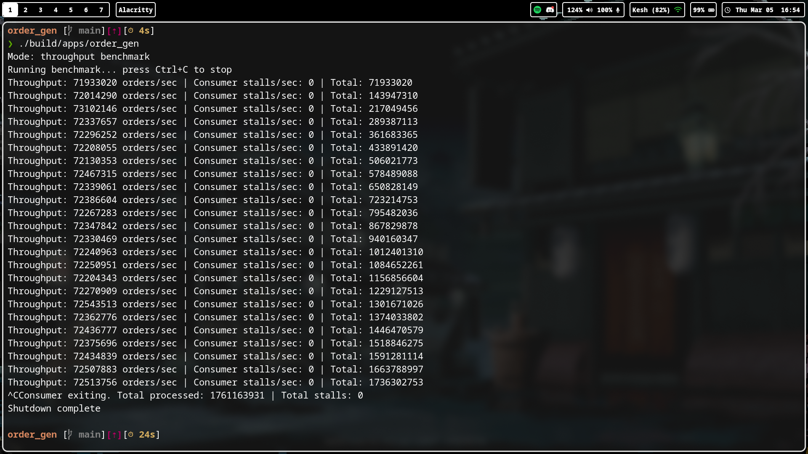

# Lock-Free SPSC Ring Buffer Order Generator

A high-performance **single-producer single-consumer (SPSC) ring buffer** written in modern C++.

This project simulates a simplified trading pipeline and benchmarks:

• message throughput  
• queue latency  
• consumer stalls  

Architecture:

Producer Thread → Lock-Free Ring Buffer → Consumer Thread

The system is designed to explore **low-latency messaging patterns used in trading systems, telemetry pipelines, and high-frequency data processing**.

---

# Features

- Lock-free SPSC ring buffer
- Cache-line aligned data structures
- Power-of-two ring buffer indexing
- Acquire/Release memory ordering
- Throughput benchmarking
- Latency histogram with percentiles
- Runtime benchmark modes
- Sampling to avoid measurement distortion

---

# Project Structure

include/
common/
types.h # Order types
core/
ring_buffer.h # Lock-free SPSC queue

src/
core/
producer.cpp # Order generator
consumer.cpp # Queue consumer + metrics
main.cpp # Benchmark harness

---

# Build

make release

Binary:

build/apps/order_gen

---

# Benchmark Modes

## Throughput Mode

Measures maximum queue throughput.

./build/apps/order_gen

Example output:

Throughput: 60,900,000 orders/sec
Consumer stalls/sec: 0

---

## Latency Mode

Measures latency distribution using a **logarithmic histogram**.

./build/apps/order_gen latency

Example output:

Latency cycles | p50: 384 p99: 768 p999: 24576
Throughput: 31,500,000 orders/sec

---

# Latency Measurement

Latency is measured as:

consumer_timestamp - producer_timestamp

using the CPU **timestamp counter (TSC)**.

Sampling is used to avoid affecting throughput:

1 sample every 4096 messages

Latency distribution is tracked using a **log2 histogram**, allowing efficient percentile estimation.

I'm not really sure if this is the right way to measure latency.

---

# Test Hardware

**Laptop:** Katana 15 B13VEK (REV:1.0)
**CPU:** 13th Gen Intel Core i7-13620H (16 cores, up to 4.90 GHz)
**Discrete GPU:** NVIDIA GeForce RTX 4050 Max-Q / Mobile
**Integrated GPU:** Intel UHD Graphics @ 1.50 GHz
**Storage:** 649.23 GiB used / 937.33 GiB total (ext4)
**Memory:** 9.65 GiB used / 15.32 GiB total

---

# Why Two Benchmark Modes?

Measuring latency introduces additional overhead (`rdtscp`, histogram updates).

To avoid distorting results:

Throughput mode → measures max queue speed
Latency mode → measures latency distribution

This mirrors the methodology used in benchmarks for systems such as:

- LMAX Disruptor
- Aeron
- Chronicle Queue

---

# Observations

At ~60M ops/sec, performance is primarily limited by:

CPU cache coherence traffic between cores

rather than algorithmic overhead.

This is expected for well-implemented SPSC queues.

---

# References

SPSC ring buffer: [Code](https://github.com/MengRao/SPSC_Queue/blob/master/SPSCQueue.h)
atomics: [CppCon](https://www.youtube.com/watch?v=ZQFzMfHIxng&t=3144s&pp=ygUGY3BwY29u)

